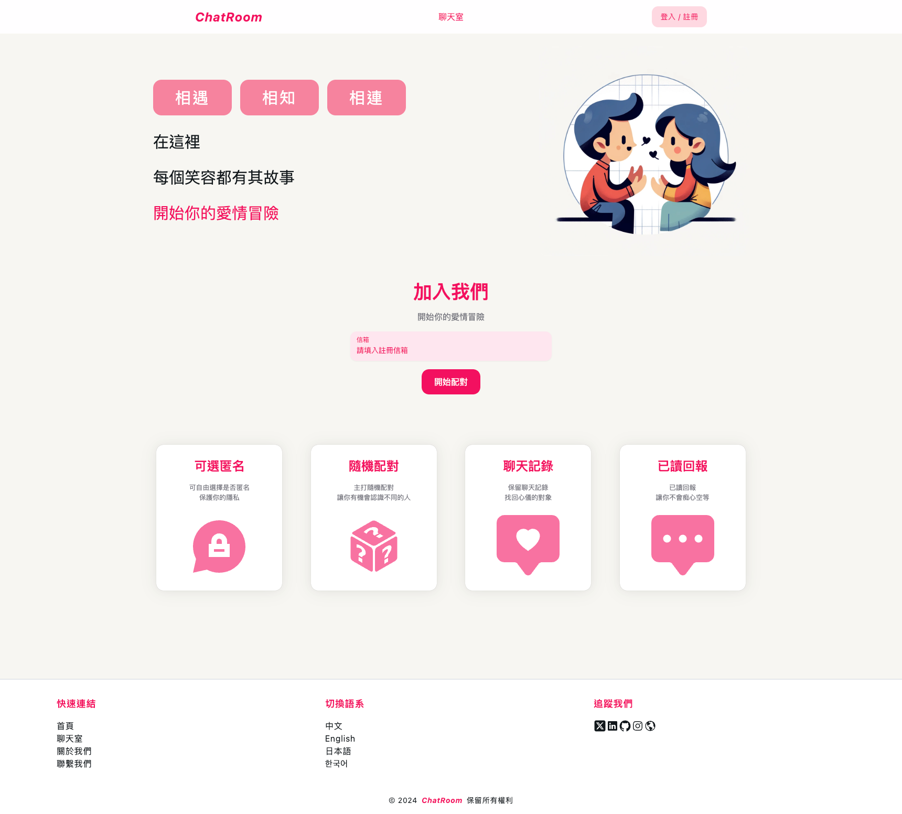
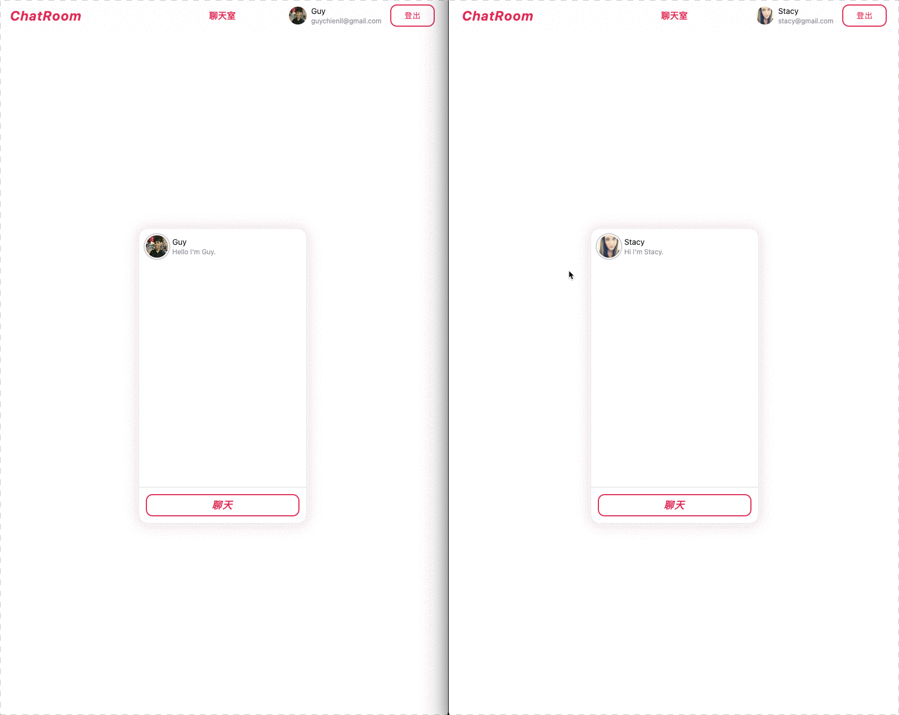

# ChatRoom

## Table of Contents

-   [ChatRoom](#chatroom)
    -   [Table of Contents](#table-of-contents)
    -   [Requirement](#requirement)
    -   [Getting Started](#getting-started)
        -   [install dependencies](#install-dependencies)
        -   [run the development server](#run-the-development-server)
        -   [build the project](#build-the-project)
    -   [Demonstration](#demonstration)
    -   [Learning Points](#learning-points)

## Requirement

| Requirement | Version |
| ----------- | ------- |
| Node.js     | 20.10.0 |
| npm         | 10.2.3  |

## Getting Started

### install dependencies

```bash
npm install
```

### run the development server

```bash
npm run dev
```

### build the project

```bash
npm run build
```

## Demonstration

[Demo](https://chatroom-frontend-eight.vercel.app/)





## Learning Points

-   WebSocket
-   File Upload Integration (AWS S3)
-   Firebase Firestore Integration
